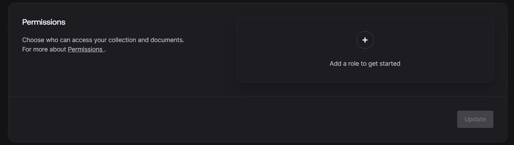

# Anonym Ink

---

**⇒ Description :** **Anonym Ink** is a platform designed for anonymous sharing of thoughts, quotes, and personal experiences. It offers a safe and private space where individuals can express themselves without fear of judgment or repercussions. Whether you're looking to share a secret, seek advice, or simply connect with others, Anonym Ink provides a welcoming environment for open communication.

**⇒ GitHub :**

**⇒ Live 🔗 :**

---

# Documentation (Follow Along)

---

## 1.0 Requirements

- ReactJS
- Appwrite
- React Hook Form

## 2.0 Project Initiation

### 2.1 Appwrite Setup

1. Sign up: https://cloud.appwrite.io/console/login?redirect=/console/
2. Create a project
3. Add required information:
    1. Appwrite URL → API Endpoint
    2. Project ID → found in settings
    3. Add services according to your requirements, found in settings
    4. Database & Bucket ID
        1. Create Database → Copy/Paste Database ID to ENV file
        2. Create Collection → Copy/Paste Collection ID to ENV file
        3. In Collection → Settings 
            
            
            
            **Add a role > All users**
            
            
            
            **For now I have given full CRUD permission but adjust accordingly in future.**
            
        4. Attributes section in collection → create attributes
            
            
            

### 2.2 Create Project

1. Create a React Vite project (or any of your choice)
2. Install dependencies:
    
    ```jsx
    npm i @reduxjs/toolkit react-redux react-router-dom appwrite @tinymce/tinymce-react html-react-parser react-hook-form
    ```
    
3. Add Tailwind CSS → https://tailwindcss.com/docs/guides/vite

### 2.3 Create an ENV File

- Must be declared with "." at the start
- This file doesn't get pushed to the git repository (i.e., it's inside .gitignore)
- In industry-grade applications, since env files are not available, there exists a file named `.env.sample`

```
# Always prefix will start from VITE since we're using VITE, else it will show "undefined"
# To access any variable from file you need to use "import.meta.env.VITE_VAR_NAME"

########################################################################################

VITE_APPWRITE_URL="https://cloud.appwrite.io/v1"
VITE_APPWRITE_PROJECT_ID="6708d356001c2bda3cce"
VITE_APPWRITE_DATABASE_ID="6708d4410015fcc22d1e"
VITE_APPWRITE_COLLECTION="6708d4c9002a1fd5806a"
VITE_APPWRITE_BUCKET_ID="6708d6c9000ba2c34ea9"
```

- Creating `conf.js` file: src>conf>conf.js
- This file is created to avoid calling variables from env with long text. Sometimes, due to minor casualties, it can compromise the entire app, hence we use conf.js

```
const conf = {
    appwriteUrl: String(import.meta.env.VITE_APPWRITE_URL),
    appwriteProjectId: String(import.meta.env.VITE_APPWRITE_PROJECT_ID),
    appwriteDatabaseId: String(import.meta.env.VITE_APPWRITE_DATABASE_ID),
    appwriteCollectionId: String(import.meta.env.VITE_APPWRITE_COLLECTION_ID),
    appwriteBucketId: String(import.meta.env.VITE_APPWRITE_BUCKET_ID),
}
export default conf
```